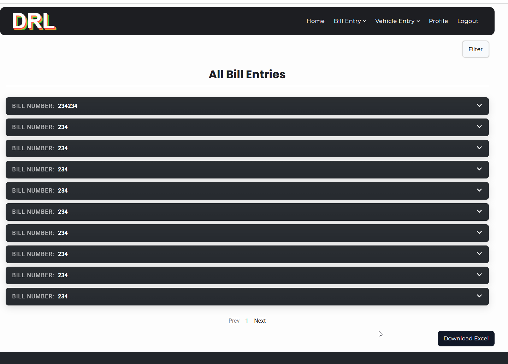
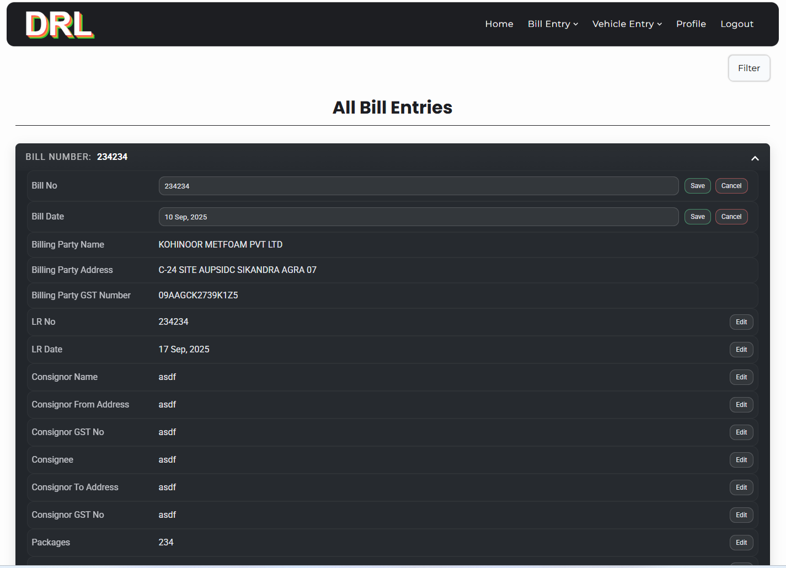
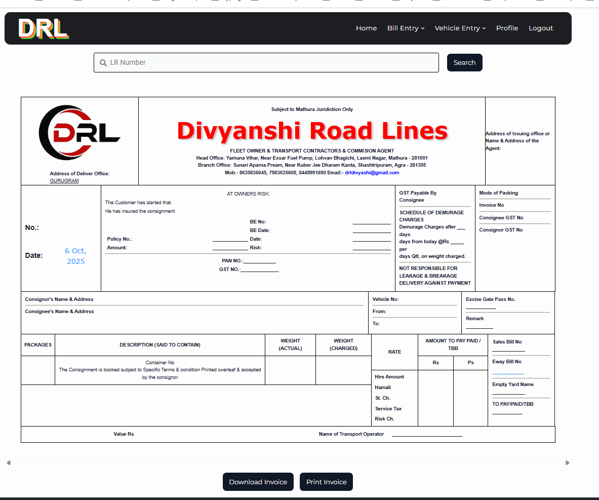
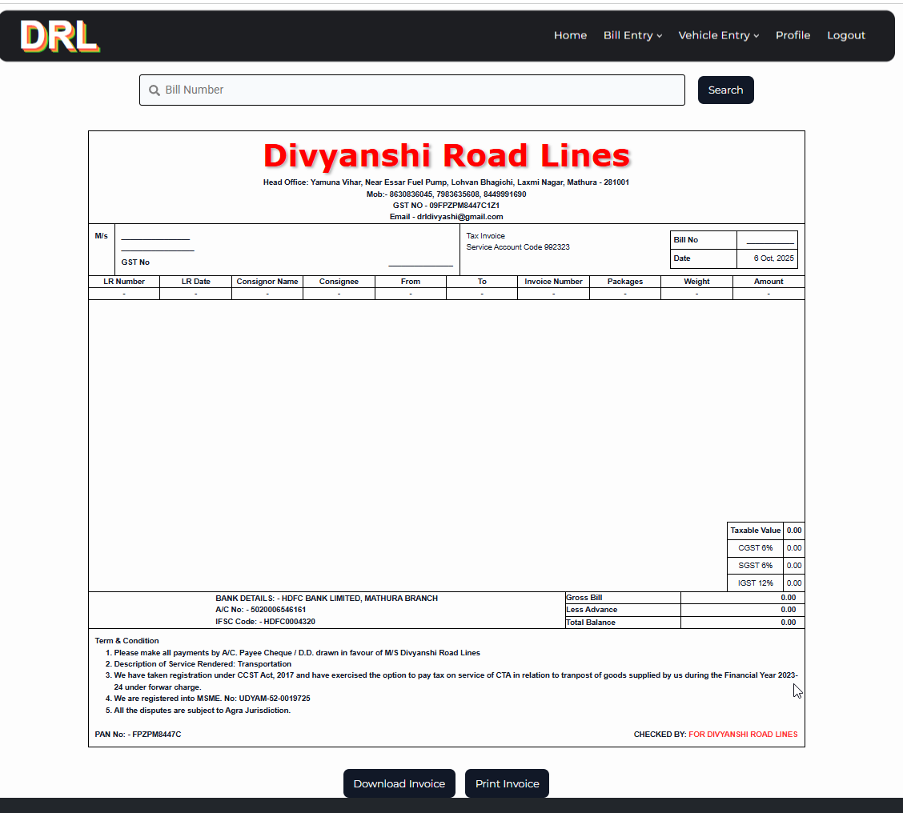
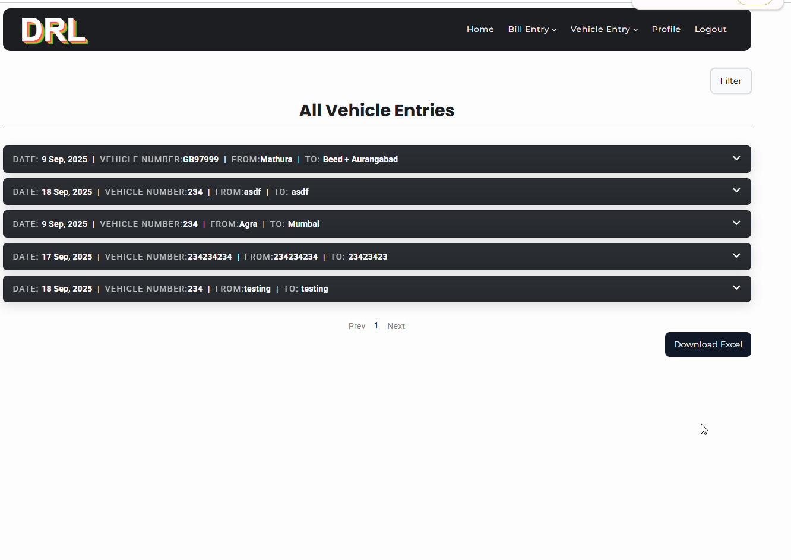
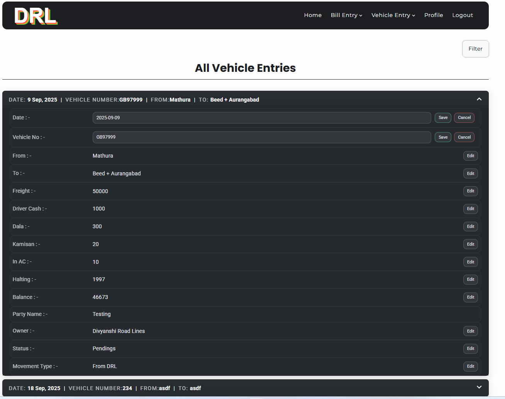
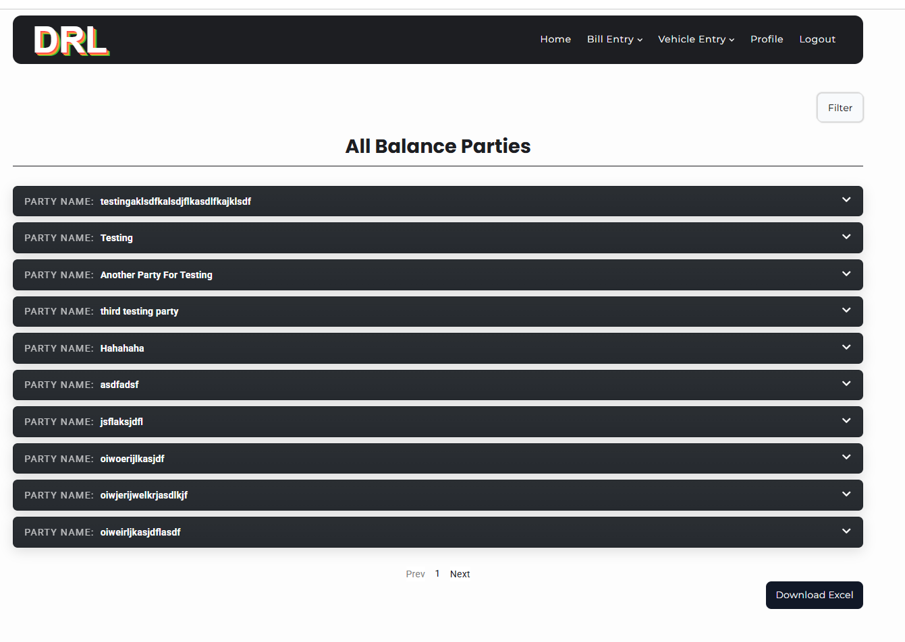
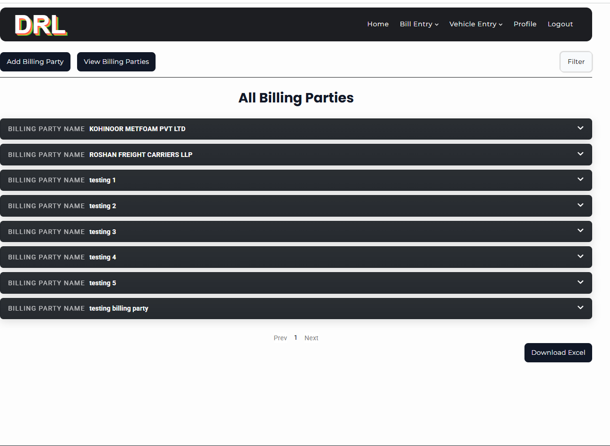
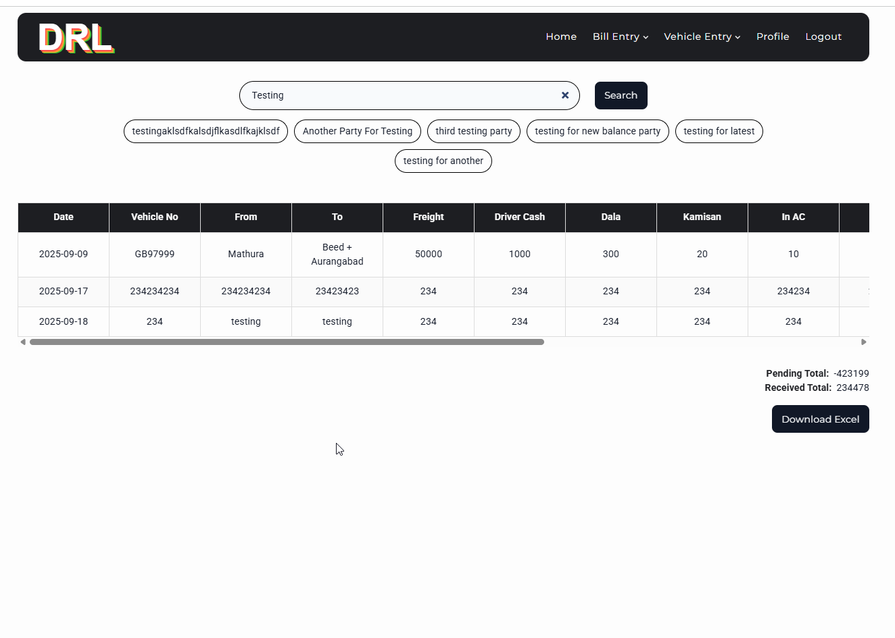

# Truck Management System
This is a Truck Management System designed to help trucking companies efficiently manage their operations. 
It allows firms to **store and print bills**, **track vehicle entries**, and maintain **all transport-related records** in a centralized system, improving organization and workflow.

## Table of Contents

 - [Features](#features)
 - [Tech Stack](#tech-stack)
 - [Screenshots & Demo](#screenshots--demo)
 - [Installation](#installation)
 - [Contact](#contact)

## Features
- Store and manage **Vehicle Entries**, **Bill Entries**, **Billing Parties**, **Balance Parties**
- Generate and print **LR Copy**, **Bills**.
- Search and filter records with multiple filter options.
- Option to export data.
- In-line edit options for all entries.
- User authentication and role-based access.
- Proper notification system.
- Pagination for different pages.
- Responsive design for mobile and desktops.

## Tech Stack

**Frontend**
- React
- Typescript
- Framer Motion

**Backend**
- Node.js / Express

**Database**
- MongoDB

**Other Tools / Libraries**
- Mongoose (MongoDB ODM)
- Axios (API requests)
- SCSS (Styling)

## Screenshots & Demo

### Screenshots

### Demo
Demo video coming soon.

## Installation

1. **Clone the repository**
- git clone https://github.com/Vishal-8630/truck-management-system.git
- cd truck-management-system

2. **Install dependencies**

- Frontend
  - cd frontend
  - npm install

- Backend
 - cd backend
 - npm install

3. **Set up environment variables**
PORT=3000
MONGO_URI=your_mongodb_connection_string
JWT_SECRET=your_jwt_secret
NODE_ENV=development

4. ** Run the application**

- Frontend
  - cd frontend
  - npm run dev

- Backend
  - cd backend
  - npm start

5. **Access the app**
Open [Local Host](http://localhost:5173) in your browser.

## Contact

**Author:** Vishal Chaudhary
**Email:** vishh8630@gmail.com
**GitHub:** [https://github.com/Vishal-8630](https://github.com/Vishal-8630)
**LinkedIn:** [https://www.linkedin.com/in/vishal8630](https://www.linkedin.com/in/vishal8630)
